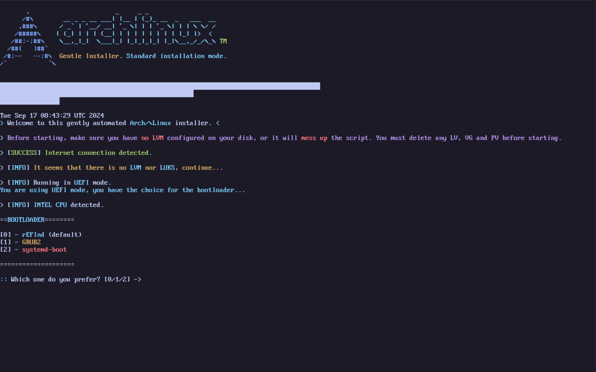

# Gentle Archlinux Installer



This script is an automated installation of Archlinux.
As I don't like that much the official "archinstall" script, I decided to do my own.

It contains much more customizations like pacman hooks, configured DNS, LUKS encryption, TTY themes, and more.

It detects if you're booting in UEFI or BIOS mode, and adjusts its questions automatically.

## How to install

First, you need an Internet connection. If you have a wired connection, it should already be set up. Otherwise, you have to configure it with `iwctl` or `networkctl`.

```bash
pacman-key --init
pacman-key --populate archlinux
pacman -Sy git
git clone https://github.com/2ELCN068/gentle-archlinux
cd gentle-archlinux
./Archlinux_Gentle_Installer.sh
```

## Parameters

- **_-e :_** Enable hardening mode ;
- **_-c :_** Full detailed installation with complete customizations options ;
- **_-m :_** Minimal installation _(Fast with default options)_.

## Issues

mmcblk devices are not supported actually.

## TODO

- [x] - Generate zshrc ;
- [x] - Ask for additionnal packages ;
- [x] - nftables + sshguard ;
- [x] - pacman hooks ;
- [ ] - pacman hook for archlinux news (informant) ;
- [ ] - pacdiff ;
- [x] - motd et issue.net ;
- [ ] - Conditions LVM ;
- [ ] - Repair f_partition_disks.sh ;
- [ ] - Remake the formatting and LVM part to eliminate duplicate or non-pratical code ;
- [ ] - Add mmcblk disk type support ;
- [ ] - Add support for swapfile/swap/zram ;
- [ ] - Add hardening mode ;
